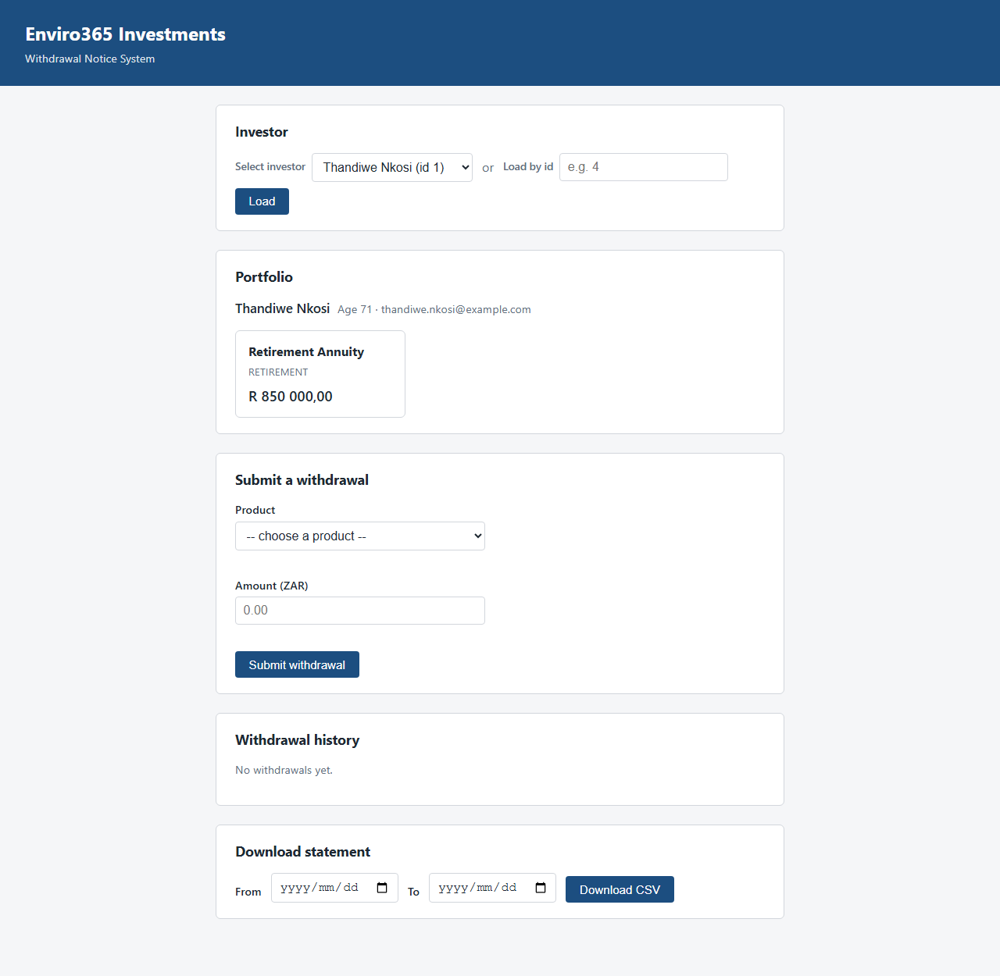
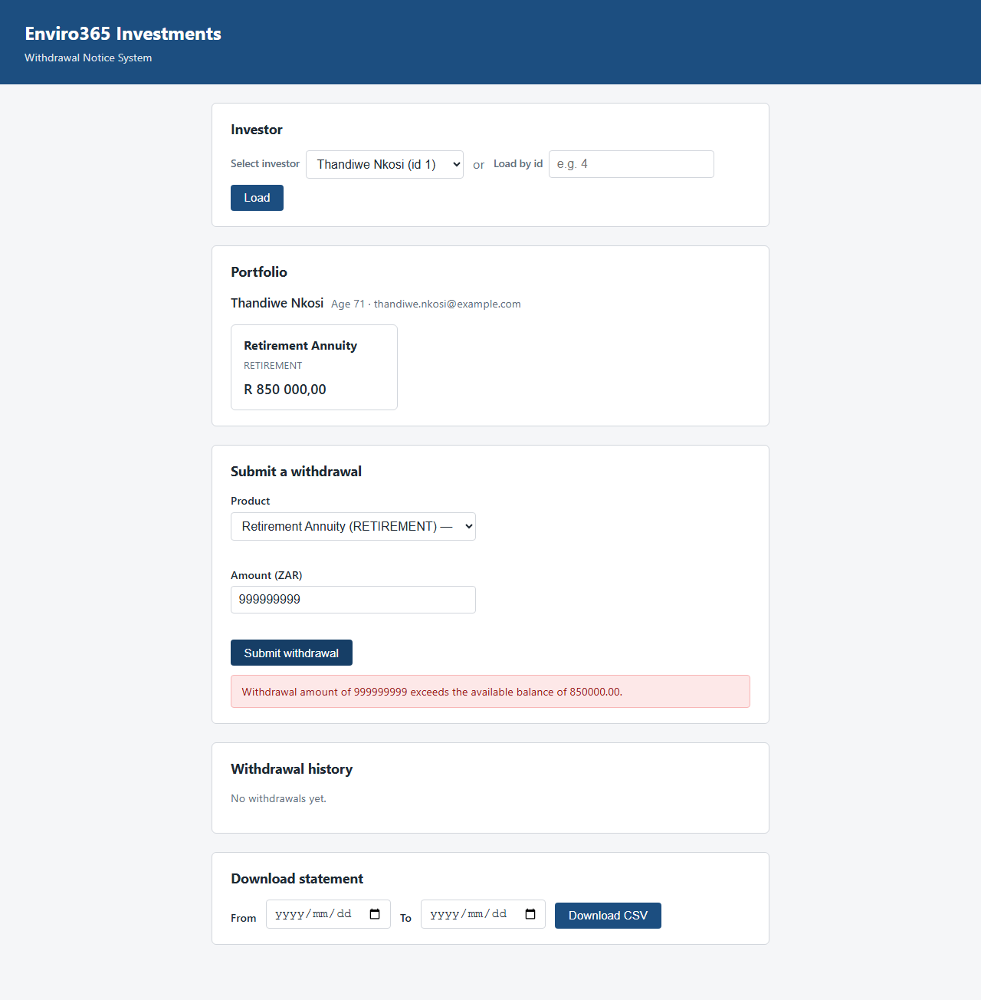
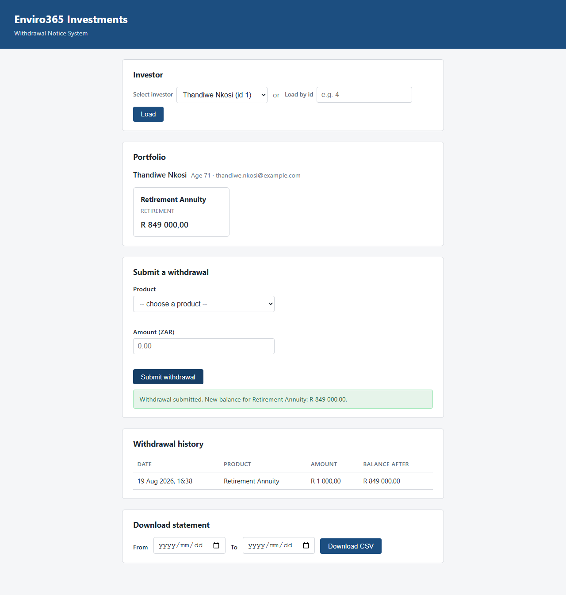

# Enviro365 Withdrawal System

Investor portfolio and withdrawal management system built for the eTalente Junior Developer Assessment
(Enviro365 Investments, 2026). Spring Boot 3 backend with an H2 in-memory database, plus a vanilla HTML/CSS/JS
frontend served by the same application  one artifact, no separate dev server, no build step for the UI.

Package root: `com.enviro.assessment.junior.gumede`

## Tech stack

- Java 17, Spring Boot 3.5.13 (Web, Data JPA, Validation)
- H2 (in-memory), seeded via `data.sql` on every startup
- Plain HTML / CSS / vanilla JavaScript frontend, no framework, no CDN dependencies
- JUnit 5 + Mockito + AssertJ for unit tests

## Setup & run

Requires a JDK 17+ and Maven 3.9+ on the `PATH`.

```bash
mvn spring-boot:run
```

The application starts on **http://localhost:8080**:

- **http://localhost:8080/** - the frontend (dashboard, withdrawal form, history, CSV export)
- **http://localhost:8080/api/...** - the REST API
- **http://localhost:8080/h2-console** - H2 console. JDBC URL `jdbc:h2:mem:withdrawaldb`, user `sa`, blank
  password. (Copy only the URL itself into the console's JDBC URL field, not the whole
  `spring.datasource.url=...` line from `application.properties`.)

To run the tests:

```bash
mvn test
```

## Seeded data

`data.sql` loads three investors on every startup (the in-memory database is recreated each run), covering the
three cases the retirement-age rule needs to be tested against:

| Id | Name | Age (as of 2026) | Products |
|---|---|---|---|
| 1 | Thandiwe Nkosi | 71 | Retirement Annuity (RETIREMENT) — R850,000.00 |
| 2 | Sipho Mahlangu | 46 | Retirement Annuity (RETIREMENT) — R320,000.00 - too young to withdraw from it |
| 3 | Lerato Dube | 35 | Flexible Savings Account, Tax-Free Savings Account (SAVINGS) |

## Business rules

Enforced in `WithdrawalService`, in this order, each with its own error message:

1. Withdrawal amount must be greater than zero.
2. Retirement (`RETIREMENT`) withdrawals are only permitted if the investor's age is **strictly greater than
   65**.
3. The amount must not exceed the product's current balance.
4. The amount must not exceed **90%** of the balance (computed with `RoundingMode.DOWN`, so the cap never
   rounds in the investor's favour).

Balance and the 90% cap are checked in that order deliberately: exceeding the full balance always also means
exceeding 90% of it, so checking the balance first means whichever error fires is the one that actually
explains the problem.

## API reference

All error responses share one shape (`timestamp`, `status`, `error`, `message`, `path`, optional
`fieldErrors`), produced by a global `@RestControllerAdvice`.

### `GET /api/investors/{id}/portfolio`

Returns the investor's details and their products.

**200 OK**
```json
{
  "id": 1,
  "firstName": "Thandiwe",
  "lastName": "Nkosi",
  "email": "thandiwe.nkosi@example.com",
  "dateOfBirth": "1955-03-14",
  "age": 71,
  "products": [
    { "id": 1, "name": "Retirement Annuity", "type": "RETIREMENT", "balance": 850000.00 }
  ]
}
```

**404 Not Found** (unknown investor id)
```json
{
  "timestamp": "2026-08-19T14:00:00Z",
  "status": 404,
  "error": "Not Found",
  "message": "Investor not found with id 999",
  "path": "/api/investors/999/portfolio"
}
```

### `POST /api/withdrawals`

Submits a withdrawal against a product.

**Request**
```json
{ "productId": 1, "amount": 1000.00 }
```

**201 Created**
```json
{
  "id": 1,
  "productId": 1,
  "productName": "Retirement Annuity",
  "amount": 1000.00,
  "balanceAfter": 849000.00,
  "requestedAt": "2026-08-19T16:07:34.033771"
}
```

**422 Unprocessable Entity** (a business rule was broken — the request was well-formed)
```json
{
  "timestamp": "2026-08-19T14:00:00Z",
  "status": 422,
  "error": "Unprocessable Entity",
  "message": "Retirement withdrawals are only permitted for investors older than 65. Investor is 46 years old.",
  "path": "/api/withdrawals"
}
```

**400 Bad Request** (missing/invalid field)
```json
{
  "timestamp": "2026-08-19T14:00:00Z",
  "status": 400,
  "error": "Bad Request",
  "message": "Validation failed for one or more fields.",
  "path": "/api/withdrawals",
  "fieldErrors": { "amount": "Withdrawal amount must be greater than zero" }
}
```

**404 Not Found** (unknown product id)

### `GET /api/investors/{id}/withdrawals`

Returns the investor's withdrawal history, newest first.

**200 OK**
```json
[
  {
    "id": 1,
    "productId": 1,
    "productName": "Retirement Annuity",
    "amount": 1000.00,
    "balanceAfter": 849000.00,
    "requestedAt": "2026-08-19T16:07:34.033771"
  }
]
```

### `GET /api/investors/{id}/statement.csv?from=YYYY-MM-DD&to=YYYY-MM-DD`

Downloads the withdrawal history as a CSV file (`Content-Type: text/csv`,
`Content-Disposition: attachment; filename="statement-{id}.csv"`). `from`/`to` are optional whole calendar
days; when both are absent, every withdrawal is returned. `from` after `to` returns **400 Bad Request**
rather than a silently empty file.

```csv
Withdrawal ID,Product ID,Product Name,Amount,Balance After,Requested At
1,1,Retirement Annuity,1000.00,849000.00,2026-08-19T16:07:34.033771
```

## Screenshots

**Portfolio dashboard**



**422 error state** (withdrawal amount exceeding the balance  the real rule text is shown, not a generic
message)



**Withdrawal submitted, dashboard and history updated without a page reload**



## AI usage disclosure

I used Claude as a coding assistant throughout this project. Most of the Java implementation was AI-generated from my specifications, then reviewed and corrected by me before being committed. I understand every class in this repository and can explain any design decision in it.

**How I worked:**
I specified each layer before it was written  the domain model, the business rules and their order, the DTO boundary, the exception mapping, the endpoints. I built and ran the application at each step rather than accepting code that only compiled, and I tested the API by hand with curl and the UI in a browser before moving on.

**Corrections I made to AI-generated code:**

• Bean Validation was initially left off the withdrawal amount on the reasoning that it would make the service-layer check redundant. That was wrong  a direct caller or unit test never passes through Bean Validation  so I added it at both layers.

• LazyInitializationException risk in the portfolio mapping: moved entity-to-DTO mapping inside the transaction and disabled open-in-view, which had been masking it.

• Age was being calculated in three places (the service, the DTO, and JavaScript). Consolidated to a single Investor.getAge().

• Malformed JSON bodies were falling through to the 500 catch-all; added an explicit 400 mapping.

• An unvalidated date range on the CSV export returned an empty file instead of a 400.

**What I decided rather than accepted:** 
storing balanceAfter on the notice rather than recomputing it; checking the balance rule before the 90% cap so each failure returns an accurate message; keeping business rules out of the client so there is one source of truth.

## Unit tests

`WithdrawalServiceTest` (`mvn test`) uses Mockito to test `WithdrawalService` against mocked repositories —
no Spring context, no database:

- one test per business rule (positive amount, retirement age, balance, 90% cap), each asserting the specific
  `WithdrawalRuleException` message and that neither repository's `save` was called, and
- one happy-path test asserting the balance was actually debited on the persisted entity and the notice was
  saved with the correct amount/balance-after/product.
